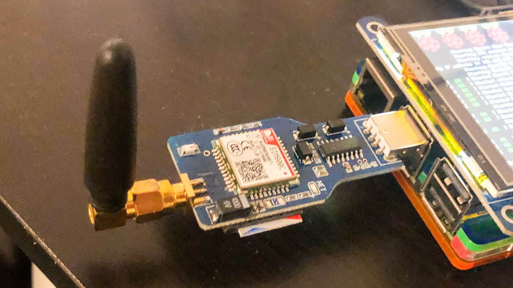

# mailMySMS

This Nodejs script checks if there are SMS messages received by my Raspberry Pi, and automatically sends them to designated emaill address when found.

<p float = "left">


</p>

## Part one

### How to forward those SMSs as emails to my email address.

Assume we have several text files in `/home/pi/sms/inbox/`, which are received by `gammu`. 

We will read them, parth them and then send them as emails to our mail box.

If you want tutorial about how to setup you Pi and GSM module, please read Part two.

### Clone this repo

```git clone git@github.com:EonYang/mailMySMS.git```

or

```git clone https://github.com/EonYang/mailMySMS.git```

### Get your Gmail credential, 

Enable your Gamil API at [here](https://developers.google.com/gmail/api/quickstart/nodejs), and download your `credentials.json`.

Put your `credentials.json` into the root of this repo.

### Edit `config.js` to specify your mail address and the path to your gammu inbox.

```
module.exports = {
    ...
    inboxPath: "/home/pi/sms/inbox/",
    archiveFolder: "/home/pi/sms/archive",
    myEmail: 'yourmail@gmail.com',
    TOKEN_PATH :'token.json',
    CREDENTIALS_PATH: 'credentials.json',
    SCOPES:'https://www.googleapis.com/auth/gmail.send',
}
```

### Run this script

```nvm use 12.16```

```npm install```

```node index.js```

If you encounter permission errors, check the ownership of your sms folder.

### Run it forever

```npm install pm2 -g```

```pm2 start index.js```

### Auto start `pm2` on reboot

```
pm2 startup

//output

To setup the Startup Script, copy/paste the following command:
sudo env PATH=$PATH:/home/pi/.nvm/versions/node/v12.16.1/bin /home/pi/.nvm/versions/node/v12.16.1/lib/node_modules/pm2/bin/pm2 startup systemd -u pi --hp /home/pi

```

Copy the command from your terminal, excute it.

```
//output:
...
Target path
/etc/systemd/system/pm2-pi.service
Command list
[ 'systemctl enable pm2-pi' ]
[PM2] Writing init configuration in /etc/systemd/system/pm2-pi.service
[PM2] Making script booting at startup...
[PM2] [-] Executing: systemctl enable pm2-pi...
Created symlink /etc/systemd/system/multi-user.target.wants/pm2-pi.service → /etc/systemd/system/pm2-pi.service.
[PM2] [v] Command successfully executed.
+---------------------------------------+
[PM2] Freeze a process list on reboot via:
$ pm2 save

[PM2] Remove init script via:
$ pm2 unstartup systemd
```

```systemctl enable pm2-pi```

```pm2 save```

Reboot your Pi and make sure `pm2` automatically started.

```sudo reboot```

```systemctl status pm2-pi```


## How to set up Raspberry Pi and GSM module.

refs:

https://wammu.eu/docs/manual/quick/index.html#
https://escapologybb.com/send-sms-from-raspberry-pi/

### 0, Preparation.

* Setup you Raspberry Pi, Raspbian or Linux.
* Get a USB GSM/3G/4G module. I use an old GSM module I bought years ago. [Link](https://item.taobao.com/item.htm?spm=a1z09.2.0.0.6fd82e8dtdibvC&id=542608922284&_u=s2ic10pfd73)
* Enable your Gamil API at [here](https://developers.google.com/gmail/api/quickstart/nodejs), and download your `credentials.json`.

### 1, Plug the USB GSM module and insert you SIM card.

### 2, Install Gammu

Install `gammu` and `gammu-smsd`.

```sudo apt install gammu``` 

```sudo apt install gammu-smsd``` 

### 3, Get the address of your USB GSM module.

Sse any of the following commands to check the type and to get the address of your USB module.

```lsusb```

```dmesg | grep ttyUSB```

```gammu-detect```

The address looks like `/dev/ttyUSB0`

### 4 Gammu configuration

Use the following command to generate config file, save it, don't worry about the contents.

```sudo gammu-config```

Use `vim` to edit the config file you just created, put in the address of the device. Don't worry about other lines.

```device = /dev/ttyUSB0```

Type this make sure gammu is able to talk to your GSM module.

```gammu --identify``` 

If you're lucky, you will see response like this:

```
Device               : /dev/ttyUSB0
Manufacturer         : SIMCOM_Ltd
Model                : unknown (SIMCOM_SIM800C)
Firmware             : Revision:1418B04SIM800C32_BT
IMEI                 : 8660******8871
SIM IMSI             : 4600******3013
```

### 5 `gammu-smsd` configuration

```sudo vim /etc/gammu-smsdrc``` to edit the config file.
git 
```
[gammu]
device = /dev/ttyUSB0
connection = at

[smsd]
service = files
logfile = syslog

debuglevel = 255

inboxpath = /home/pi/sms/inbox
outboxpath = /home/pi/sms/inbox
sentsmspath = /home/pi/sms/inbox
errorsmspath = /home/pi/sms/inbox
```

### 6 Start `gammu-smsd`

Start service:

```systemctl start gammu-smsd.service```

Make it auto start on boot:

```systemctl enable gammu-smsd.service```

Check the status of it:

```systemctl status gammu-smsd.service```

### 7 You're all set.

Income SMS message will be stored in the directory that you specified in `/etc/gammu-smsdrc`.

```inboxpath = /home/pi/sms/inbox```


